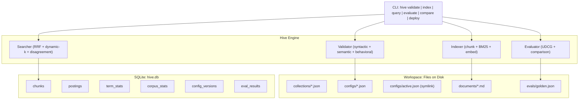

# Hive: A Retrieval Engine with Verifiable Feedback Loops

Hive is a self-contained, CLI-first retrieval engine that demonstrates closed-loop feedback for search quality. An LLM agent starts with a naive retrieval config, detects poor results through utility-based metrics (UDCG), iteratively improves the config, and deploys a measurably better version — all without human intervention.

**[Open the interactive explainer](https://vchandela.github.io/hive/docs/explainer.html)** for a visual walkthrough.

## Why Hive?

Traditional search metrics (nDCG) treat irrelevant results as harmless zeros. But when an LLM reads a search result that *looks right but is wrong* (a "distractor"), it actively corrupts the LLM's reasoning. Hive uses UDCG — a metric that assigns **-1** to distractors — making the problem visible and fixable through an automated feedback loop.

## Quick Start

```bash
pip install -r requirements.txt

# Index the document corpus (BM25-only, no API key needed)
python hive.py index workspace/collections/knowledge-base.json --no-embeddings

# Search with the default config
python hive.py query workspace/configs/v1.json --q "How do I authenticate API requests?"

# Evaluate config quality against golden test set
python hive.py evaluate workspace/configs/v1.json

# Run the full agent demo (requires OPENAI_API_KEY)
python demo.py
```

## Architecture



## CLI Commands

| Command | What it does |
|---------|-------------|
| `hive validate <config>` | Check config for syntactic and semantic errors |
| `hive index <collection>` | Read docs, chunk, build BM25 index + embeddings |
| `hive query <config> --q "..."` | Search and return ranked results |
| `hive evaluate <config>` | Score config against golden test set (nUDCG) |
| `hive compare <config_a> <config_b>` | Side-by-side quality comparison |
| `hive deploy <config>` | Deploy config (refuses if quality regresses) |

## Key Metrics

| Metric | Before (v1) | After (v3) | Change |
|--------|-------------|------------|--------|
| nUDCG | 0.35 | 0.75 | +114% |
| Distractors | 4 | 0 | -100% |
| Human intervention | — | — | Zero |

## License

MIT
